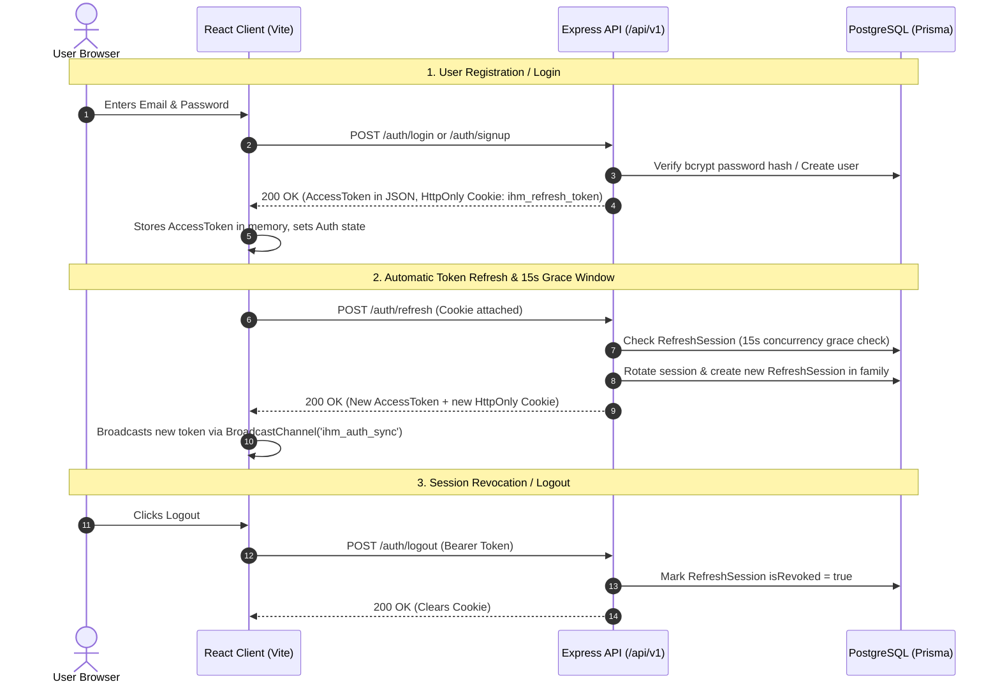
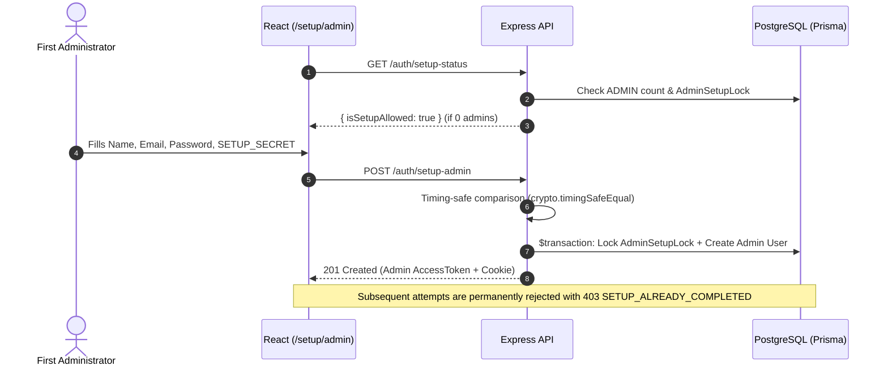
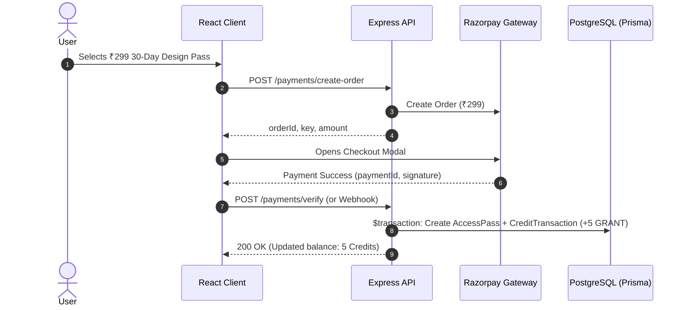
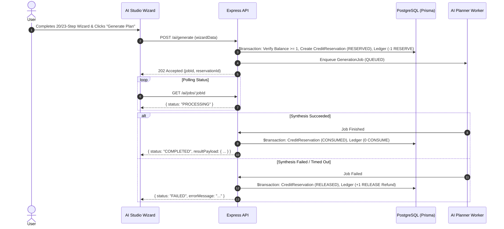

# Indore House Makers — Core User Flows & Journeys

---

## 1. User Authentication & Session Lifecycle

---

## 2. One-Time Admin Setup Flow (`/setup/admin`)

---

## 3. ₹299 Design Pass & Credit Ledger Flow

---

## 4. AI Generation Wizard & Reservation State Machine

---

## 5. User Panel Journey (Phase 2)

1. **Dashboard Entry**: User logs in and visits `/dashboard` on mobile/desktop.
2. **Overview Cards**: User sees active pass badge, remaining credits, and quick CTAs.
3. **Projects Tab**: User browses generated floor plans, views specifications, and downloads high-definition CAD/PDF files.
4. **Saved Designs Tab**: User reviews bookmarked house plans from the public catalog.
5. **Consultations Tab**: User tracks status of scheduled architect review calls.
6. **Credit History Tab**: User reviews transparent immutable ledger entries (`GRANT`, `RESERVE`, `RELEASE`).
